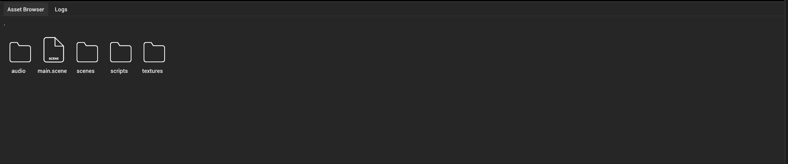

# Asset browser

Asset browser shows all the assets that you have in your engine.

## Importing assets

Assets can be imported by right clicking in the asset browser and clicking "Import asset"

## Organizing assets

You can organize your assets in any way you like by grouping them into directories. You can create directories by right clicking on the asset browser and clicking "Create directory". Creating directories in the asset browser creates real, filesystem directory in the assets directory.

We recommend grouping assets based on asset type to make it easier to find them.
