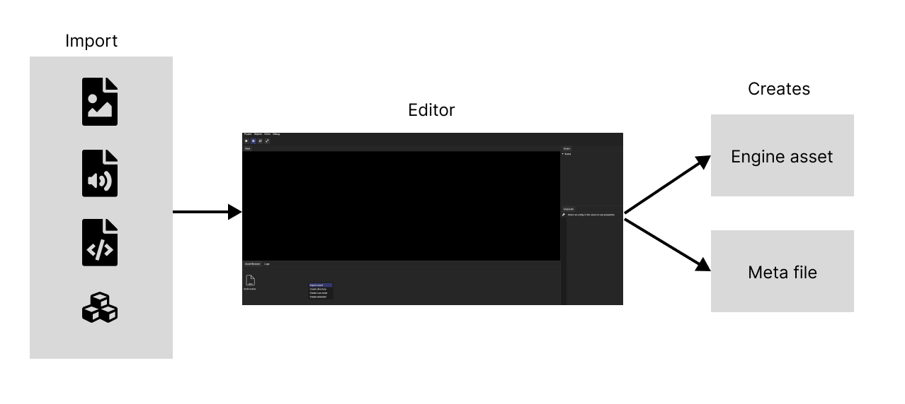

# Importing assets

Firstly, it creates engine optimized assets and stores them in **cache** directory. One file can create more than one engine optimized asset file. For example, GLTF files can creates individual animation, mesh, material assets.

:::caution Do not change cache directory

Cache directory should not never be modified manually as it can lead to undefined behaviors. Additionally, the cache directory should not be checked into the version control.

For convenience, we already provide a `.gitignore` file that will exclude the cache directory.

:::

Secondly, a meta file will be created in the **assets** directory. This YAML based metafile stores the hash of the imported asset and UUIDs associated with the asset.

:::caution Include meta files in version control

Make sure to include the meta files in your version control since without them, the engine will not be able to associate internal referenced assets with imported assets.

:::
