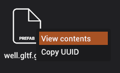

# Working with prefabs

Prefabs are special type of assets because they contains and reference other assets when being created.

## Spawning prefabs

You can spawn prefabs by double clicking on the prefab asset in the asset browser. If prefab consists of only one **root** entity, it will spawn one entity in the scene. If prefab consists of more than one root entity, all the root entities will be grouped by an entity. This makes it easier to move, scale, and rotate prefab and ensuring that all the children will get the translations.

Once prefabs are spawned in the scene, they are stored in the scene as separate entities and have no association with the prefab.

## Viewing contents of prefab

If you want to view contents of a prefab, you can right click on a prefab in the asset browser and click "View contents". This will open prefab like a directory and display all the **assets** that are available in the prefab.

