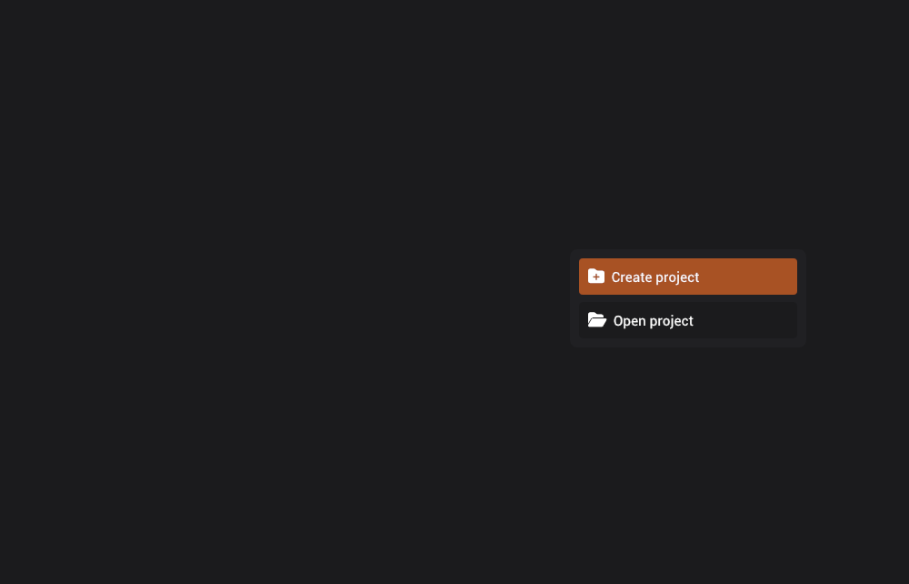

# Creating a project

Projects can be created by clicking the "Create project" button in project selector screen, choosing a path, and setting a name.

When you type a project name, it will automatically create a new directory and a project file with extension `.Quoll`.
