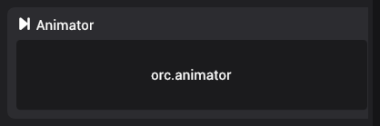
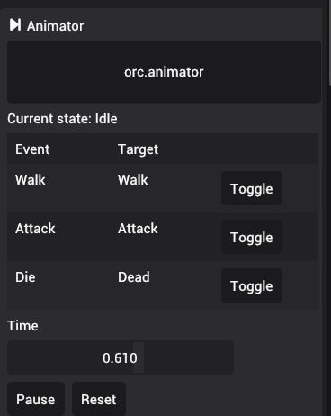

# Animator

Animators allow controlling animations for an entity using a state machine. The animators are created as assets, then attached to entities to create instances that represent the current state of the animation for an entity. You can read more about animators in [Working with animators](../asset-pipeline/working-with-animators) page.

In the example image above, the current state is shown as "AttackChop". The table below the current state shows what states the animator can transition from "AttackChop."

## Testing animator states

In order to test the animations and the animator states, the animator component provides additional controls during simulation mode.

The new "Toggle" button next to each state allows toggling between animator states. The time, shows unnormalized time of currently running animation. The "Pause" button pauses the animation in current time and the "Reset" button resets the animation time to beginning. You can also manually move the time by dragging the slide.
