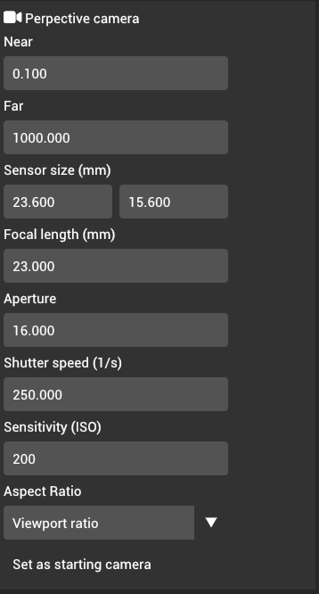
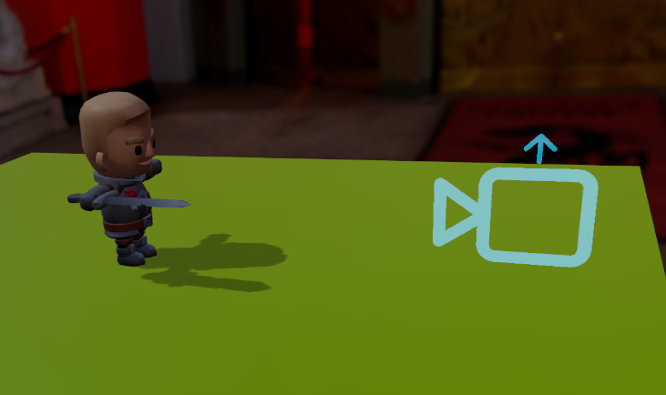
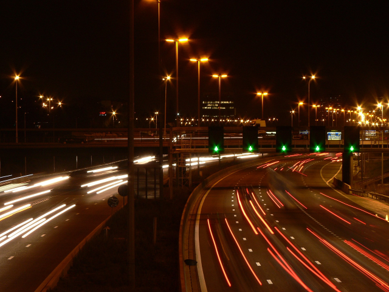

# Camera

Cameras are the entry point for rendering the scene. What a player sees in a game always comes from the viewport of the camera.

We currently only support perspective camera for rendering the scene. The perspective camera properties are based on real-world, physical camera properties:

## Defining view matrix

The camera's view matrix can be calculated by moving the camera around the scene. The camera's up vector is shown by the arrow on the gizmo:

## Defining projection matrix

The near, far planes, aspect ratio, and the Field of view is used to calculate perspective projection matrix of the camera. By default, the aspect ratio is set to "Viewport ratio", which is calculated automatically based on viewport size. You can switch it to "Custom" and provide your own aspect ratio if necessary.

The field of view is calculated based on sensor size and focal length. To be precise, we provide both the width and height of a sensor but for calculations, it is only necessary to set the height of the sensor.

## Setting as starting camera

To make a camera be the starting camera of the scene, click the "Set starting camera" button:

## Defining exposure

The exposure of the lens is defined by aperture (in f-stops), shutter speed (in 1/s), and sensitivity (ISO). These three properties are used to calculate the [exposure value](https://en.wikipedia.org/wiki/Exposure_value), which is then used to define the exposure of the scene.

### Aperture

In optics and photography, [aperture](https://en.wikipedia.org/wiki/Aperture) is the opening on the lens through which light can travel. When the opening is large (i.e wide aperture), more light can go through the lens, which increases exposure. When opening is small (i.e narrow aperture), less light can go through the lens, which decreases the exposure of the overall scene.

**Relation to f-stops**

In photography, f-stops are typically displayed as `f/{Value}`. Example: `f/22`, `f/2.8` etc. Larg f-stops (e.g `f/22`) have narrow aperture while small f-stops (`f/2.8`) have wide aperture. In order to make it easier to define these values in Quoll engine, we perform this division ourselves and you can provide easier to read values. For example, to define `f/2.8` aperture, you can enter `2.8` in the input field.

**Depth of field**

:::warning Work in progress

At the moment, depth of field effect does not exist in engine but it is planned to be implemented.

:::

Aperture has direct correlation to depth of field. Wide apertures (e.g `f/2.8`) result in blurrier depth of field while narrow apertures (e.g `f/22`) do not have very small depth of field

### Shutter speed

[Shutter speed](https://en.wikipedia.org/wiki/Shutter_speed) is the length of time that the camera sensor is open. When the camera sensor is open for a long period of time (i.e slow shutter speed), it receives more light, which ends up illuminating the scene more. When the camera sensor is open for a short period of time (i.e fast shutter speed), it receives less light, which ends up illuminating the scene less.

**Defining shutter speed:**

Shutter speed values are typically defined in `1/{Value} seconds`. The word "speed" can be confusing since speed is typically measures in `1/s`. This is why shutter speed is also referred to as exposure time. However, we call this property shutter speed because it is aligned with how it is being called in photography. In order to make it easier to define these values in Quoll engine, we perform the division on our side and you can provide easier to read values in the engine. For example, to define `1/250s` shutter speed, you can provide `250.0` in the input field.

**Motion blur:**

:::warning Work in progress

At the moment, motion blur effect does not exist in engine but it is planned to be implemented.

:::

Slow shutter speed means that the camera is still receiving light and has not captured the scene yet. This is why if camera moves or if an object moves in the scene, it will result in motion blur. To avoid moving the camera in real world, photographers typically attach their cameras to a tripod and use some kind of remote (e.g IR remote or phone) to take the photo without touching the camera. Since we are in a simulated world, there is no reason for our camera to be moved :)

However, motion blur can also be used to blur the scene for artistic purposes. For example, the effect of cars looking like light beams in the photo below is a result of slow shutter speeds:

### ISO

In photography, camera sensitivity, or ISO, is a software technique to increase the brightness of the photo. Unlike aperture and shutter speed, which increase exposure based on incoming light, ISO increases brightness after the photo is taken. You can

**Defining ISO**

ISO is defined by whole numbers such as `ISO 200`, `ISO 500` `ISO 2000` etc. You can do the same in the engine by set the ISO values.

**Film grain**

:::warning Work in progress

At the moment, motion film grain effect does not exist in engine but it is planned to be implemented.

:::

In real world photography, because ISO is a software solution, higher ISO values results in film grain artifacts. Since we are simulating the physical camera, we do not have this limitation in the engine.

However, film grain is useful for artistic purposes. For example, film grain can be useful to give effect of night vision cameras in a game.
