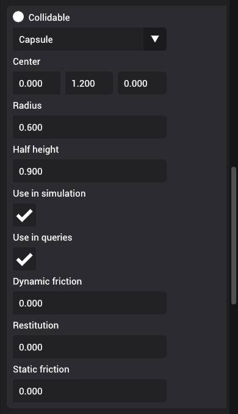

# Collidable

Collidable component adds physical colladible properties to the entity and includes the entity in collision tests.

You can set the collidable shape, friction, and restitution properties.

## Shape measurements

There are four shapes available -- Box, Sphere, Capsule, and Plane.

- **Boxes** are measured using half extents in each direction. By default, the dimensions of box shape is 1m (half extent = 0.5m) in all directions.
- **Spheres** are measured using radius. By default, the radius is 1m.
- **Capsules** are measures using radius and half height. By default, the radius is 1m and the height is 1m (half height = 0.5m)
- **Planes** do not have any measurements since they take up infinite space

### Center

Center property is used to reposition the collidable shape relative to the world coordinate of the entity. By default, the collidable shapes
are always resized in symmetrically starting from (0, 0, 0). By modifying the center, it is possible to resize the shape assymetrically.

### Relation to scale:

Shape parameters will scale with the object's world scale. So, make sure to define shape measures in relative to local transform.

## Collidable triggers

There are two triggers that are provided for collidable shapes -- simulation and query.

### Use in simulation

You can decide to use the collidable shape in simulation, which will include the collidable shape in physics simulations.

### Use in query

When this flag is enabled, the collidable shape will be included in manual queries that are performed from scripts.

## Friction

There are two types of friction -- static and dynamic friction

Static friction defines the amount of friction that is applied between surfaces that are not moving lateral to each-other. Dynamic friction defines the amount of friction applied between surfaces that are moving relative to each-other.

## Restitution

Restitution defines elasticity of a collidable object. Objects collide elastically when restitution is `1.0` and collide inelastically when restitution is `< 1.0`.
