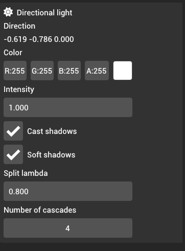
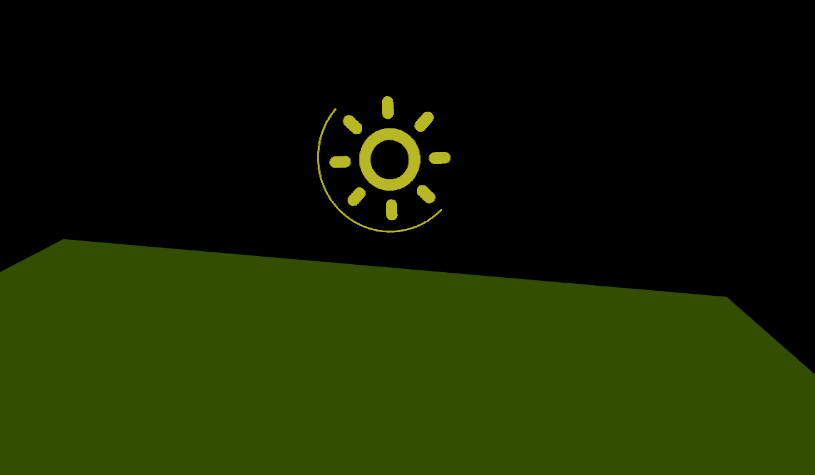

# Directional light

Directional lights represent lights that are available throughout the scene, similar to a sun. Directional lights typically have directions.

Since directional lights are entities on their own, they can still be positioned anywhere in the scene; however, the position in this case is used **only** as a reference in the editor as the position and scale transforms are not applicable for directional lights.

Direction of the directional light is set by rotating the entites in the scene. You can read the calculated direction vector in the inspector panel or you can identify the direction by looking at the yellow arc that goes around the gizmo:

From the inspector panel, you can modify the intensity and the color of the light.

## Casting shadows

You can cast shadows from directional lights by checking the "Cast shadows" checkmark. You can modify the number of cascades (max 6 cascades) and enable soft shadows as well. Cascades in the cascaded shadow maps are split using interpolation between logarithmic and linear interpolation. The "Split lambda" value is the interpolation factor between these two values. In this case, `1.0` split lambda means that the cascades will be split using logarithmic algorithm.
