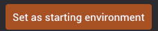

# Environment

Environment is an entity that contains multiple environment specific components. There can **only** be one active environment in the scene. In this page, we are going to look into different components that make up the environment.

## Skybox

Skybox is a component that sets a background skybox to the world. Skybox can either be color value or a texture.

### Setting starting environment

You can set the starting environment by clicking "Set as starting environment" button in Skybox component:

### Color skybox

When skybox is color, you can set RGB color to the skybox.

### Texture skybox

For texture skyboxes, you can drag an environment asset (e.g HDRI texture) to set the skybox.

## Environment lighting

Environment lighting is used to illuminate the entire environment. Unlike directional lights, environment lights provide significantly higher number of lights sources to light up the environment. Typically, these lights are stored in an image (commonly referred to as image based lighting). At the moment, we only support HDRI environment textures to illuminate the environment and the environment lighting is tied to the skybox. So, in order to light up the environment you must have both skybox and environment lighting components together. In this case, environment lighting will be based on the skybox image or color.

