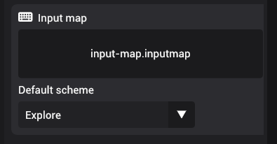
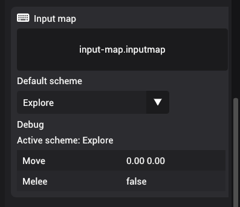

# Input map

Input maps are attached to entity to provide access to the commands, values, and schemes using the scripting interface. You can set an input map by dragging an input asset to the draggable area. You can also set the default scheme that will be used during simulation.

## Debugging input map commands

When in simulation mode, the input map component will provide currently active scheme and the values of all the commands based on input.

