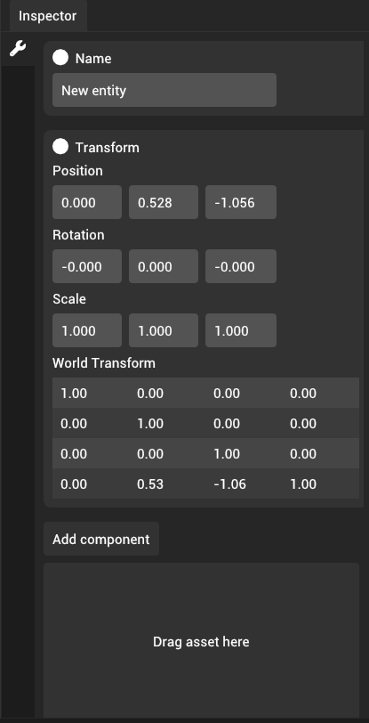
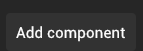
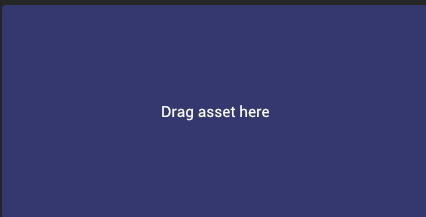

# Inspector panel

Inspector panel provides means to modify components of selected entities in the scene.

### Adding new components

New components can be added by clicking the "Add component" button located at the bottom of the panel.

Note that you can only add non asset specific components with this button.

### Creating components from assets

Some components are associated with an asset and require you to drag an asset to the "Drag asset here" located at the bottom of the panel.

