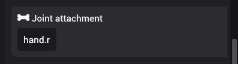
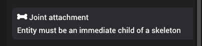
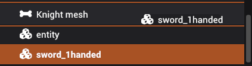
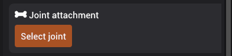

# Joint attachment

Joint attachment component is used to attach an entity to a joint of a parent skeleton.

## Attaching entity to a joint

To attach an entity to a joint, the entity with the joint attachment component **must be** immediate child of an entity that has a skeleton. If entity is not an immediate child of an entity with skeleton, joint attachment component will display the following message:

You can drag the entity as a child of skeleton by dragging it in the scene panel:

Once entity is dragged, the joint attachment will show a button to open the choose a joint:

When a joint is selected, the transform of the entity will always be relative to the world coordinate of a joint. This process is automatic. Once you select the joint, now you can change the transforms to fit your needs.

## Demo

import jointAttachmentDemo from './img/joint-attachment-demo.mp4';

<video src={jointAttachmentDemo} controls title="Title" width="600"></video>
