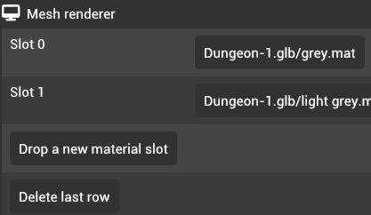

# Mesh renderer

Mesh renderers are used to render meshes in the scene. There are two types of mesh renderers -- static mesh renderers (called "Mesh renderer") and skinned mesh renderers.

## Static mesh renderers

Static mesh renderers are used to render the static meshes that are attached to the entity. This component requires that the mesh component references a static mesh.

## Skinned mesh renderers

Skinned mesh renderers are used to render the skinned meshes that are attached to the entity. This component requires that the mesh component references a skinned mesh and the entity has a skeleton component. Otherwise, the mesh will not be rendered on the scene.

## Materials

The mesh renderer allows modifying materials of a mesh. The materials use a slot based system where each slots represents a submesh of a mesh.

You can replace materials in existing slots by dragging a material asset to the slot. You can add new materials by dragging a material asset to "Drop a new material slot." You can remove the last material by clicking "Delete last row"
