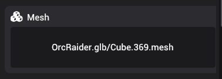

# Mesh

Mesh components reference a mesh that is associated with an entity. You can drag any mesh from your asset browser to the entity to add or update mesh of an entity. Note that, adding a mesh component does not render the mesh in the scene. For that, you need the mesh renderer component.

You can update the mesh by dragging a new mesh asset to the drag and drop area.
