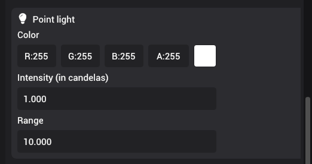

# Point lights

Point lights represent small lights in the scene that typically light up a small portion of the scene.

You can set the position of the point light by moving the light in the scene. From the inspector panel, you can set the color, intensity (in candelas), and range of the point light. Range of the light is mainly used as a performance optimization to be ignored in calculations where the light is too far from the scene. Point lights illuminate the objects based on intensity. The intensity is reduced by the inverse square of the distance between the light and the point on the object.

Note that point lights illuminate the scene uniformly in all directions; so, scale and rotational transforms do not contribute to the light calculation. You can still set these properties to adjust the gizmos in the editor.
