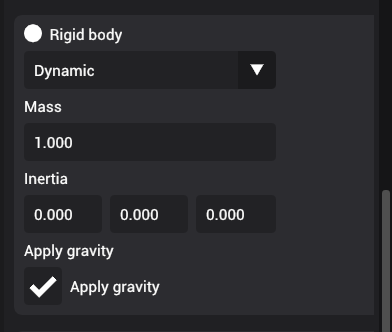

# Rigid body

Rigid bodies are undeformable physics objects that are affected by external forces.

Rigid bodies have mass and intertia. You cannot apply forces to rigid body from the editor.

## Gravity

Gravity is a special force in the engine that automatically applies gravitational force to the object:

:::caution Work in progress

At the moment, gravity is always calculated using -9.8 and cannot be modified at this time.

:::
