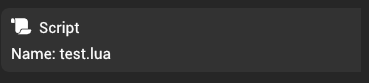

# Scripting

Scripting component allows running custom scripts in the scene.

You can create or update a script by dragging a script asset into the drag and drop area.

You can find more information about scripting in the [Scripting API](/scripting/scripting.md) documentation.
