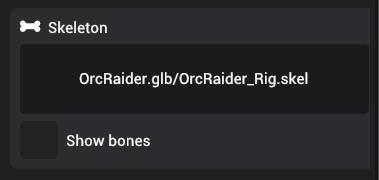

# Skeleton

Skeleton components provide bone structure to a skinned mesh. The main use-case for skeletons is animations.

You can update the skeleton by dragging a new skeleton asset to the drag and drop area.

In order to view the skeleton in the editor, you can check the "Show bones" checkmark, which shows debug bones for the skeleton in yellow color:

