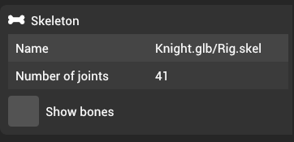
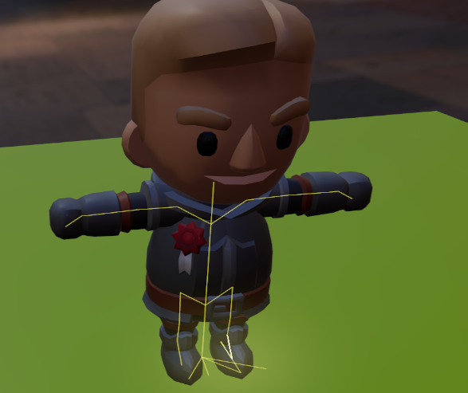

# Skeleton

Skeleton components provide bone structure to a skinned mesh. The main use-case for skeletons is animations.

All properties of skeleton are read only since skeleton components are created from assets.

In order to view the skeleton in the editor, you can check the "Show bones" checkmark, which shows debug bones for the skeleton in yellow color:

