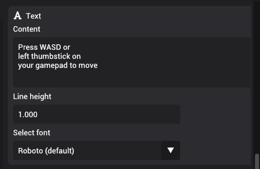

# Text

Text component is used to render text in the scene.

You can set the content of text, line height, and the font. By default, the engine **always** provides [Roboto](https://fonts.google.com/specimen/Roboto) as the default font. If you want to allow custom fonts, all you need to do is import your font asset to the project. To create multi line text, just press the "Enter" key to create a new line. The distance between lines is determined by the line height property.
