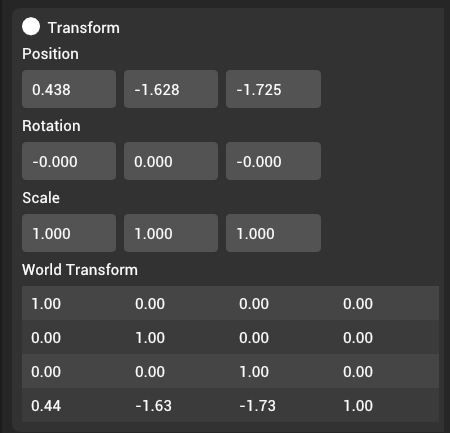

# Transform

Entity transforms consist of two components -- local transform and world transform. The local transform component represents the position, rotation, and scale of a component relative to a parent. **Local transform can be modified via UI or the scripting interface.** The world transform component represents the final calculated transform of an entity in the world. **This value is always automatically calculated from local transform and cannot be modified.**



## Local transform

The local transform component consists of three elements -- position (XYZ), rotation, and scale (XYZ). Internally, the rotation is stored as quaternion. However, to make setting rotation easier, the UI allows modifying the rotation using Euler angles.

## World transform calculation

If entity has no parent (i.e is a root entity), the world transform will be equal to the local transform:

```
worldTransform = localTransform
```

If entity is a child of another entity, the world transform will be calculated by multiplying parent's world transform to child's local transform:

```
worldTransform = parent.worldTransform * localTransform
```

If entity is a child of an entity with skeleton and has a joint attachment component, the world transform is calculated by multiplying parent's world transform to joint's world transform and to child's local transform:

```
worldTransform = parent.worldTransform * attachedJoint.worldTransform * localTransform
```
