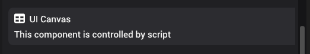

# UI Canvas

UI Canvas is a component that allows rendering UI components on. Currently, when adding a canvas, the canvas will act as a HUD that takes up the space of entire screen. Once the component is added, you can use [scripting](../../scripting/entity/ui-canvas.md) to render UI elements.

