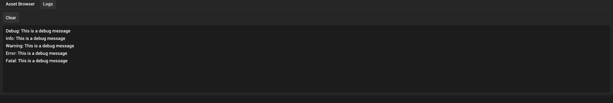

# Logger

```lua
local logger = game:get('Logger')
```

Logger service provides a way to log meaningful messages about the script. In editor, all logged messages are stored in the `Logs` tab:



## Reference

### `debug(message: string): void` {#debug}

Logs debug message

```lua
local logger = game:get("Logger")
logger.debug("This is a debug message")
```

**Parameters:**

- `message`: Log message as string.

### `info(message: string): void` {#info}

Logs info message

```lua
local logger = game:get("Logger")
logger.info("This is an info message")
```

**Parameters:**

- `message`: Log message as string.

### `warning(message: string): void` {#warning}

Logs warning message

```lua
local logger = game:get("Logger")
logger.warning("This is a warning message")
```

**Parameters:**

- `message`: Log message as string.

### `error(message: string): void` {#error}

Logs error message

```lua
local logger = game:get("Logger")
logger.debug("This is an error message")
```

**Parameters:**

- `message`: Log message as string.

### `fatal(message: string): void` {#fatal}

Logs fatal message

```lua
local logger = game:get("Logger")
logger.debug("This is a fatal message")
```

**Parameters:**

- `message`: Log message as string.
