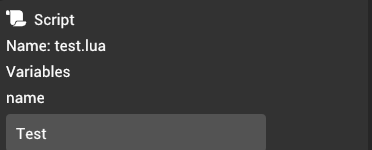
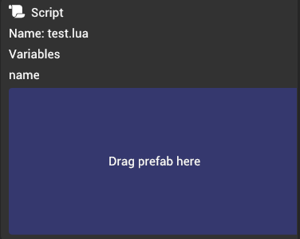

# Variables

A lot of the times, we need a way to inject variables into scripts to access data within the engine. To accommodate for that, Quoll Engine provides a way to inject variables from editor directly into the script using Lua functions.

## Registering variables

You can register the variables using the provided `input_vars.register` function.

### `input_vars.register(name: string, type: InputVarType): T` {#input_vars_register}

This is the main method to register variables in scripts for injection.

```lua
local entity_spawner = game:get('EntitySpawner')
local rock_prefab = input_vars.register('rock', input_vars.types.AssetPrefab)

entity_spawner.spawnPrefab(rock_prefab)
```

**Parameters:**

- `name`: Variable name is a unique identifier to identify the variable. The name is stored in the scene file to be accessible from both the editor and runtime.
- `type`: Variable type represents what the script accepts. The type automatically determines what is returned from the variable.

**Returns:**

Value of the variable depending on the provided type and stored value.

:::caution Registration lifecycle

Make sure to register the variables only as a global variables. Registering variables anywhere else will fail to register the variables. Variables are intentionally registered **only** once during script load and the reference to the function is removed afterwards.

:::

## Variable types

### `input_vars.types.String` {#string}

```lua
local value = input_vars.register('test', input_vars.types.String)
```

**Returns:**

String value.

**UI:**



### `input_vars.types.AssetPrefab` {#asset-prefab}

```lua
local value = input_vars.register('test', input_vars.types.AssetPrefab)
```

**Returns:**

Numeric internal ID representing prefab.

**UI:**



### `input_vars.types.AssetPrefab` {#asset-texture}

```lua
local value = input_vars.register('test', input_vars.types.AssetTexture)
```

**Returns:**

Numeric internal ID representing texture.

**UI:**


